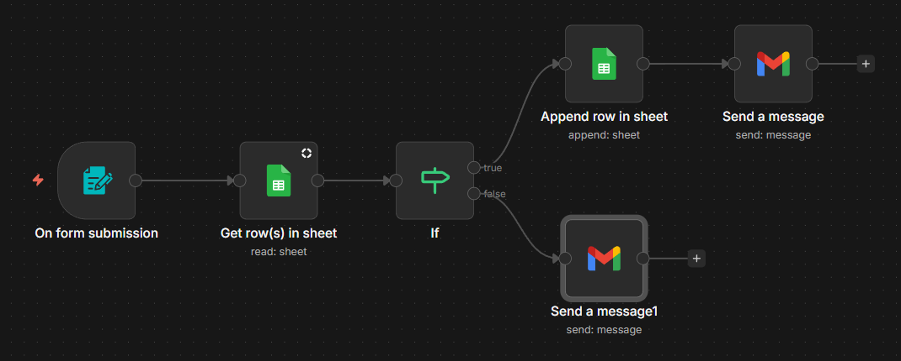
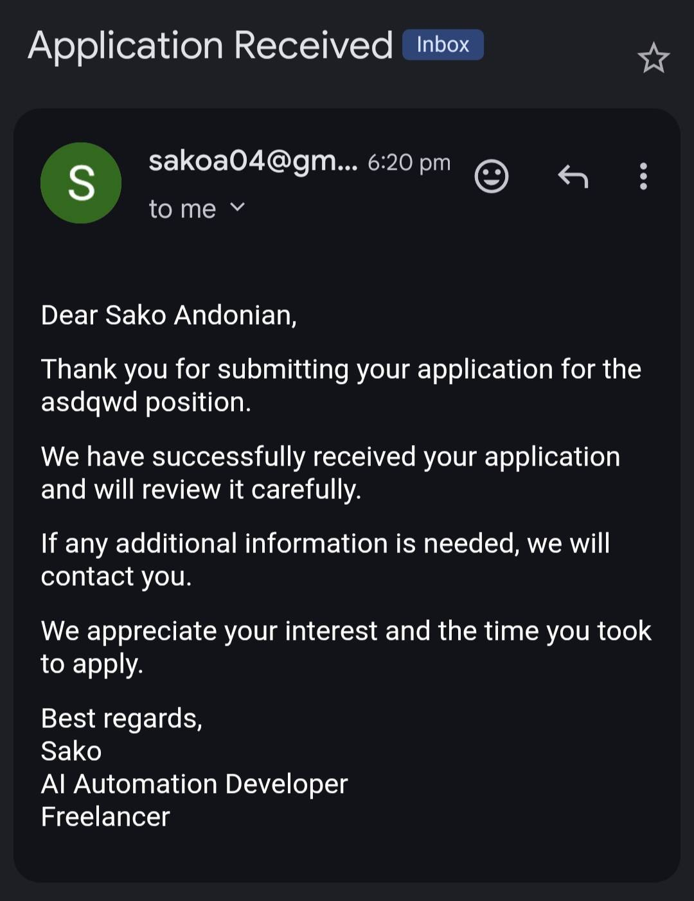
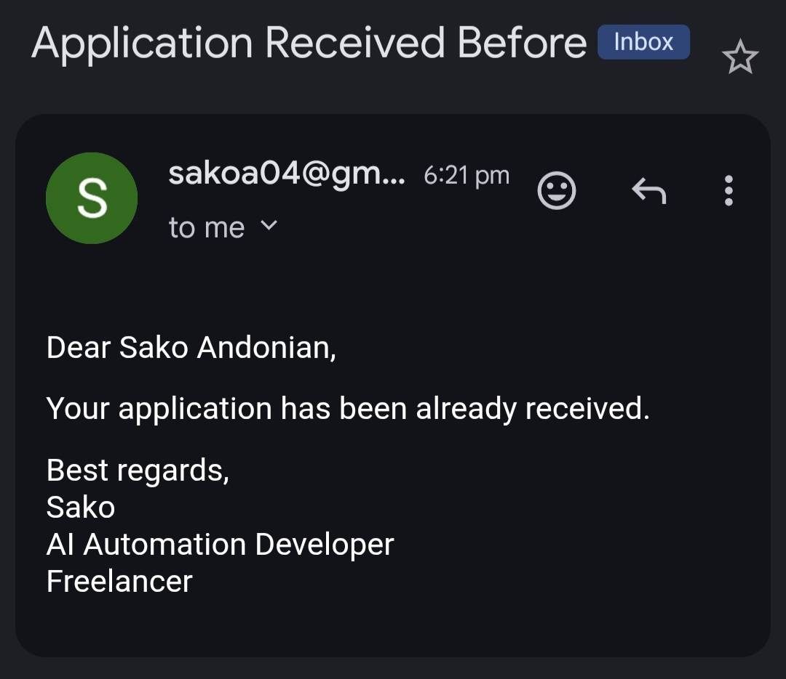

# Job Application Form → Google Sheets → HTML Confirmation Email

## Description

This workflow is built in n8n to automate job application submissions:

- Applicants submit a form
- Submissions are saved in Google Sheets
- New applicants receive a professional confirmation email (HTML)
- Duplicate submissions receive a polite notice

## Flow
Form submission → check for duplicate email → save to Google Sheets → send personalized HTML confirmation email

## Workflow Overview

## Emails

### First-time submission

### Duplicate submission

## Features

- Deduplication based on email (24h)
- Personalized HTML emails
- Clean, professional format
- Easy to extend for multiple roles or companies

## How to Run

1. Install n8n locally
2. Import `workflow.json`
3. Connect your Gmail account
4. Start workflow, submit the form

## Tech Stack
- n8n
- Google Sheets API
- Gmail API
